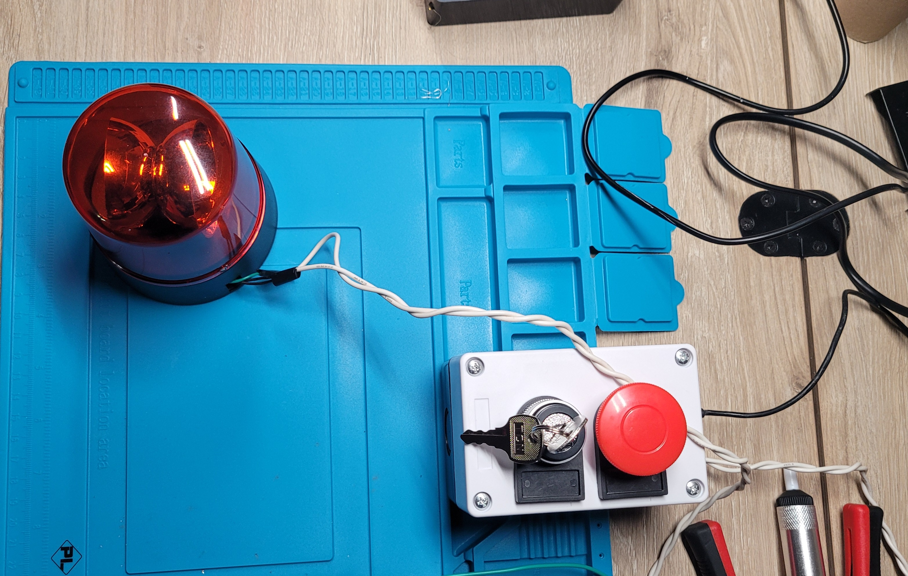
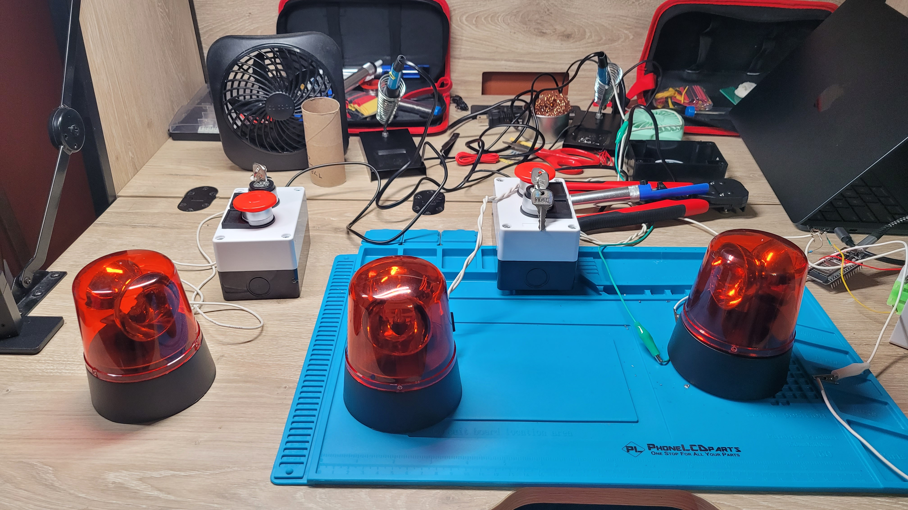

# 🚨 nuke-button

A three-person emergency hotline. Press your button, and everyone's siren lights up — no matter where in the world you are.

Built by a trio of friends who will be in different college campuses, this project uses ESP32 microcontrollers and a free pub-sub notification service to sync a physical alarm across desks, cities, and networks.

## How it works

Each person has a desk unit: a big red button and a rotating LED siren, powered from the wall. Press your button, and:

1. Your own siren fires immediately (local, no network dependency)
2. An alert publishes to a shared [ntfy](https://ntfy.sh) topic
3. The other two units, listening on that same topic, receive the alert and fire their sirens too
4. Everyone's phone gets a push notification

No self-hosted server, no port forwarding, no paid infrastructure — every unit only makes *outbound* connections, so it works from behind any home or campus network.

<p align="center">
  
  
</p>

```
Button pressed on Unit A
        │
        ├──► Unit A's siren fires locally
        │
        └──► Alert published to ntfy.sh topic
                     │
              ┌──────┼──────┐
              ▼      ▼      ▼
           Unit B  Unit C  Phones
           fires   fires   get push
           siren   siren   notification
```

## Hardware (per unit)

- **ESP32 DevKitC (WROOM-32)** — WiFi-capable microcontroller, programmed via Arduino IDE
- **Large arcade-style momentary push button** (mushroom cap, normally-open)
- **Rotating LED siren/beacon** with its own battery pack (or DC power source)
- **NPN transistor** (PN2222 or S8050) — lets the ESP32 switch the siren without powering it directly
- **1kΩ resistor** — current-limits the transistor's base
- **Flyback diode** (1N4001 or similar) — protects against voltage spikes from the siren's motor
- Breadboard / perfboard, jumper wires, micro USB cable + wall adapter

### Why a transistor?

A GPIO pin can only safely source ~20mA. The siren's motor draws far more. The transistor acts as an electronically-controlled switch: the battery pack powers the siren directly, and the ESP32's GPIO only sends a small control signal to the transistor's base, switching the high-current path on and off. The GPIO never touches the siren's actual power.

```
Battery (+) ──────────────── Siren (+)
Siren (−) ─────────────────── Transistor Collector
Transistor Emitter ─────────── Common ground (ESP32 GND + Battery −)
GPIO ──[1kΩ resistor]────────── Transistor Base
```

A diode across the siren's terminals (banded end toward positive) absorbs the motor's kickback spike when the transistor switches off — without it, that noise can crash or reset the ESP32.

## Software stack

- **Arduino IDE**, ESP32 board package
- **[ntfy.sh](https://ntfy.sh)** — free, no-signup pub/sub notification service. Each unit publishes to and subscribes from one shared topic over an HTTPS streaming connection for near-instant delivery.
- No paid server, no MQTT broker to manage, no account required.

## Pin reference (ESP32 WROOM-32 DevKit)

| Function | GPIO |
|---|---|
| Button input | GPIO 18 |
| Siren control (transistor base) | GPIO 22 |

Both are safe general-purpose pins — avoid strapping pins (GPIO 0, 2, 5, 12, 15), flash-connected pins (GPIO 6–11), and the UART pins (GPIO 1, 3) used by Serial/USB.

## Setup

1. Install the **ESP32 board package** in Arduino IDE.
2. Flash `nuke_button.ino` to each board, changing these two lines per unit:
   ```cpp
   const char* UNIT_ID = "YourName";   // unique per board
   const char* ssid = "YourWiFiName";
   const char* password = "YourWiFiPassword";
   ```
3. Keep `NTFY_TOPIC` **identical** across all three boards — this is the shared channel that links them. Use a long, unguessable string (topics aren't password-protected).
4. Wire each unit per the diagram above.
5. Install the [ntfy app](https://ntfy.sh/app) on each phone and subscribe to the same topic for push notifications.

## Testing

**Single-unit test (no second board needed):**
```bash
curl -d "ALERT from TestUnit" ntfy.sh/your-topic-name
```
Your unit's siren should fire within a second or two, simulating a remote press.

**Two/three-unit test:** press one unit's button — confirm the others fire without their buttons being touched, and that phones subscribed to the topic get a notification.

## Design notes & lessons learned

- **GPIO can't power the siren directly** — always switch it through a transistor.
- **The flyback diode is not optional** — without it, motor noise can cause false button re-triggers and inconsistent timing (looks like random behavior, but it's electrical noise resetting or confusing the board).
- **Debounce + a "don't re-trigger while active" guard** in software makes the system robust even if some hardware noise slips through.
- **A persistent streaming connection** (rather than polling) gives near-instant delivery and is also more stable for long-running devices, since it avoids the repeated TLS handshakes that can fragment the ESP32's memory over time.
- **A scheduled daily reboot** is built in as a simple safety net for devices meant to run unattended, 24/7.

## Roadmap

- [ ] Move from breadboard/alligator clips to soldered perfboard in an enclosure
- [ ] Swap in the final industrial-style button and beacon
- [ ] Add buzzer/audible alarm
- [ ] Portable (battery-powered) variant
- [ ] Campus WiFi (WPA2-Enterprise) support for on-campus deployment

## Architecture rationale

Built and debugged iteratively — started with `webhook.site` to validate the WiFi → HTTP send chain, then moved to `ntfy.sh` for real bidirectional sync and phone push. No self-hosted server was ever needed: every unit only makes outbound connections to a public, free service, which is what makes cross-campus (and cross-anywhere) triggering possible without networking gymnastics.
